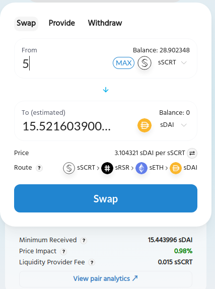
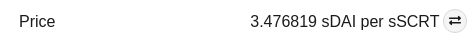
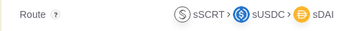

# Swapping on SecretSwap

The SecretSwap app has three sections: Swap, Provide and Withdraw. To swap tokens, click on the Swap tab and select the SecretToken you have and wish to exchange from the drop-down. If you have a viewing key in your wallet, your balance for that SecretToken will be displayed.

Next, pick the SecretToken you wish to receive from the second drop-down. The app will report your balance for this second SecretToken if you have a viewing key. If you don't, you can click the "View" button to generate one.

Next, enter the amount of the SecretToken you have that you wish to swap. The SecretSwap app will calculate a route through the existing liquidity pools and provide you with an estimated amount of the target SecretToken you selected.

The SecretSwap app also provides additional information about your swap:

- Price: SecretSwap will report the current exchange rate between the two SecretTokens you have selected. You can flip between the two rates by clicking on the double arrow icon on the right. For the example below, clicking the icon would show the price in sSCRT per sDAI. Clicking it again would return to showing the price in sDAI per sSCRT. The price reported is determined by the ratios in the liquidity pools involved in the trade and may differ from the overall market rate. 

- Route: SecretSwap features a routing engine that searches existing liquidity pools to find a path from your source token to your target token, looking to provide the best available price. This feature allows you to swap tokens even when there is no liquidity pool available for your trading pair, or the direct trading pair may have low liquidity.

## Fees

## Slippage
